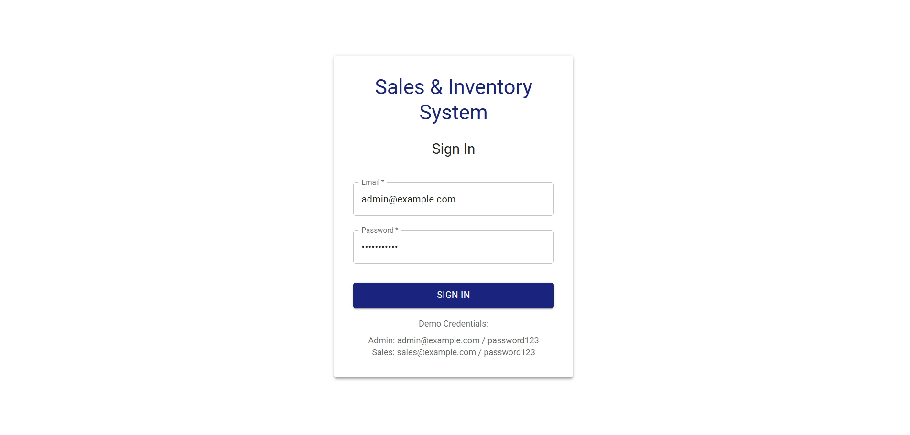
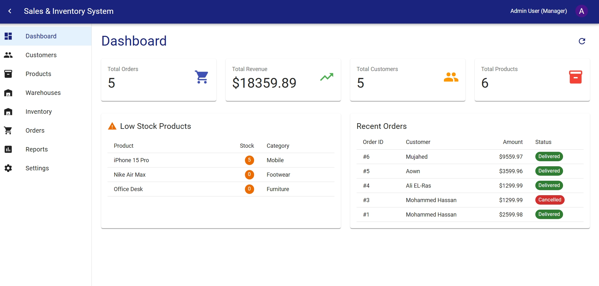
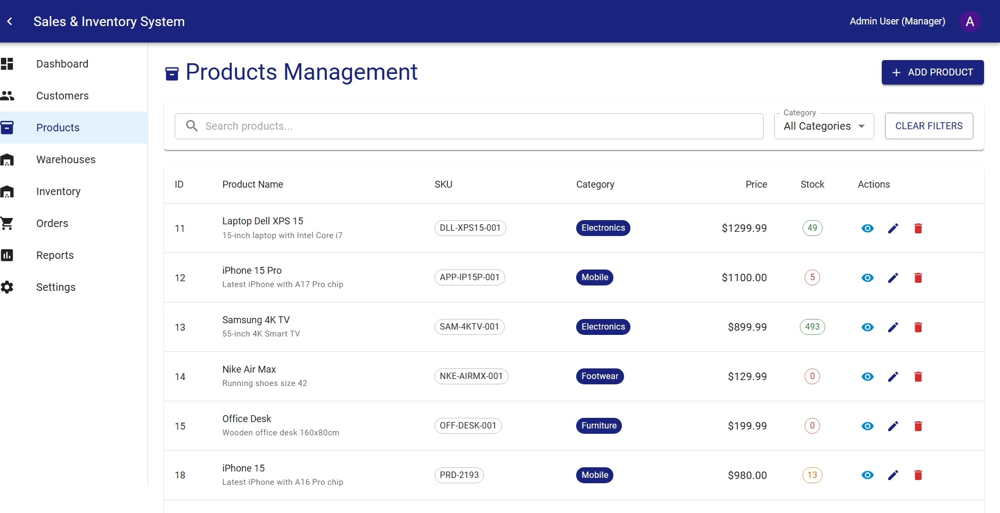
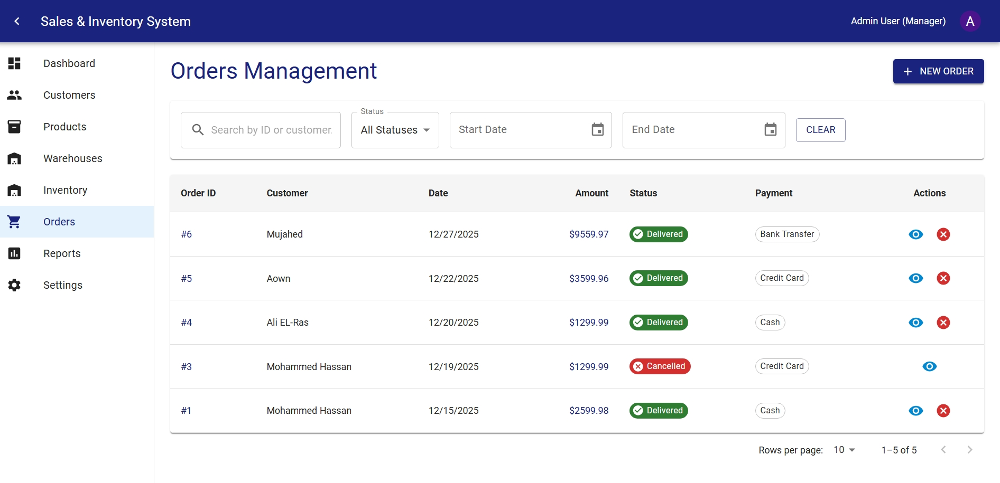
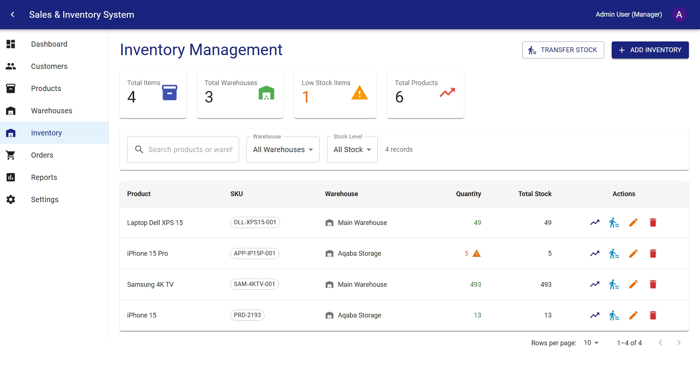
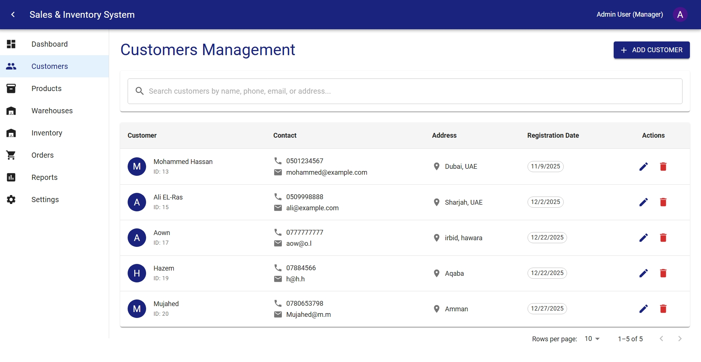

# 📦 **Sales and Inventory Management System**


## 📋 **Table of Contents**
- [Overview](#overview)
- [Features](#features)
- [Technology Stack](#technology-stack)
- [Screenshots](#screenshots)
- [Installation](#installation)
- [Environment Setup](#environment-setup)
- [Database Setup](#database-setup)
- [API Documentation](#api-documentation)
- [Project Structure](#project-structure)
- [User Roles](#user-roles)
- [Usage Guide](#usage-guide)
- [Testing](#testing)
- [Deployment](#deployment)
- [Contributing](#contributing)
- [License](#license)

## 🚀 **Overview**

A comprehensive **Sales and Inventory Management System** built with Laravel 12 (Backend) and React 18 (Frontend). This system helps retail companies manage their sales operations, inventory tracking, customer relationships, and business reporting in a centralized platform.

**Live Demo:** [Coming Soon]

## ✨ **Features**

### 🔐 **Authentication & Security**
- Role-based access control (Manager, Sales, Warehouse)
- Secure password hashing
- Session management

### 📦 **Inventory Management**
- Real-time stock tracking across multiple warehouses
- Low stock alerts and notifications
- Stock transfer between warehouses
- FIFO (First-In-First-Out) inventory deduction
- Batch stock updates

### 🛒 **Sales & Order Processing**
- Multi-product order creation
- Real-time inventory validation
- Order status tracking (Pending → Processing → Shipped → Delivered)
- Automatic inventory deduction
- Order cancellation with stock restoration

### 👥 **Customer Management**
- Customer profile management
- Order history tracking
- Customer segmentation
- Contact information management

### 📊 **Reporting & Analytics**
- Sales performance dashboards
- Inventory valuation reports
- Top-selling products analysis
- Customer purchase patterns
- Export reports to PDF/Excel

### ⚙️ **System Administration**
- User account management
- Role and permission configuration
- System settings
- Database backup/restore

## 🛠 **Technology Stack**

### **Backend**
- **Laravel 12** - PHP Framework
- **MySQL 8.0** - Relational Database
- **Laravel Sanctum** - API Authentication
- **Eloquent ORM** - Database Operations
- **Stored Procedures & Triggers** - Advanced SQL Features

### **Frontend**
- **React 18** - UI Library
- **Vite** - Build Tool
- **Material-UI (MUI)** - Component Library
- **Axios** - HTTP Client
- **React Router DOM** - Navigation
- **Recharts** - Data Visualization

### **Development Tools**
- **Postman** - API Testing
- **MySQL Workbench** - Database Management
- **Git & GitHub** - Version Control
- **Docker** - Containerization (Optional)

## 📸 **Screenshots**

### **Login Page**



### **Dashboard**



### **Products Management**



### **Orders Management**



### **Inventory View**



### **Customer Management**



## 📦 **Installation**

### **Prerequisites**
```bash
# Backend Requirements
PHP >= 8.2
Composer >= 2.5
MySQL >= 8.0
Node.js >= 18.0
NPM >= 9.0
```

### **Clone the Repository**
```bash
git clone https://github.com/yourusername/sales-inventory-system.git
cd sales-inventory-system
```

## ⚙️ **Environment Setup**

### **1. Backend Setup**
```bash
# Install PHP dependencies
composer install

# Copy environment file
cp .env.example .env

# Generate application key
php artisan key:generate

# Install Laravel Sanctum
php artisan vendor:publish --provider="Laravel\Sanctum\SanctumServiceProvider"
```

### **2. Database Configuration**
Edit `.env` file:
```env
DB_CONNECTION=mysql
DB_HOST=127.0.0.1
DB_PORT=3306
DB_DATABASE=sales_db
DB_USERNAME=root
DB_PASSWORD=your_password
```

### **3. Run Migrations & Seeders**
```bash
# Run migrations
php artisan migrate

# Seed database with sample data
php artisan db:seed

# Or run fresh migration with seeders
php artisan migrate:fresh --seed
```

### **4. Frontend Setup**
```bash
# Navigate to React directory
cd frontend

# Install Node.js dependencies
npm install

# Start development server
npm run dev
```

### **5. Start Servers**
```bash
# Terminal 1: Start Laravel Backend
php artisan serve --port=8000

# Terminal 2: Start React Frontend
cd frontend
npm run dev
```

**Access the Application:**
- Frontend: http://localhost:5173
- Backend API: http://localhost:8000

## 🗄️ **Database Setup**

### **Database Schema**
The system uses 7 main tables:
1. **users** - System users and authentication
2. **customers** - Customer information
3. **products** - Product catalog
4. **warehouses** - Storage locations
5. **inventory** - Stock quantities per warehouse
6. **orders** - Sales transactions
7. **order_items** - Order line items

### **Sample Data**
Default users created by seeders:

| Email                  | Password    | Role       | Access                           |
|------------------------|-------------|------------|----------------------------------|
| admin@example.com      | password123 | Manager    | Full Access                      |
| sales@example.com      | password123 | Sales      | Sales & Customer Management      |
| warehouse@example.com  | password123 | Warehouse  | Inventory Management             |


## 📡 **API Documentation**

### **Authentication**
```http
POST /api/login
Content-Type: application/json

{
  "email": "admin@example.com",
  "password": "password123"
}
```

### **Endpoints Overview**

| Method | Endpoint                 | Description          | Required Role          |
|--------|--------------------------|----------------------|------------------------|
| GET    | `/api/products`          | Get all products     | All                    |
| POST   | `/api/products`          | Create new product   | Manager                |
| GET    | `/api/orders`            | Get all orders       | Sales, Manager         |
| POST   | `/api/orders`            | Create new order     | Sales, Manager         |
| PUT    | `/api/orders/{id}`       | Update order status  | Sales, Manager         |
| GET    | `/api/inventory`         | Get inventory        | Warehouse, Manager     |
| POST   | `/api/inventory/transfer`| Transfer stock       | Warehouse, Manager     |


### **Postman Collection**
Import the Postman collection from `/docs/postman_collection.json` for complete API testing.

## 📁 **Project Structure**

```
sales-inventory-system/
├── app/                          # Laravel Backend
│   ├── Http/Controllers/Api/     # API Controllers
│   ├── Models/                   # Eloquent Models
│   └── ...
├── database/
│   ├── migrations/               # Database migrations
│   └── seeders/                  # Sample data seeders
├── frontend/                     # React Frontend
│   ├── src/
│   │   ├── components/           # Reusable components
│   │   ├── pages/                # Application pages
│   │   ├── services/             # API services
│   │   ├── context/              # React Context
│   │   ├── routes/               # API routes
│   │   └── styles/               # CSS styles
│   │   └── ...
│   └── ...
├── .env.example                  # Environment template
├── composer.json                 # PHP dependencies
├── package.json                  # Node.js dependencies
└── README.md                     # This file
```

## 👥 **User Roles**

### **1. Manager**
- Full system access
- User management
- Report generation
- System configuration
- Oversee all operations

### **2. Sales Staff**
- Create and manage customer profiles
- Process sales orders
- View product availability
- Generate invoices
- Track order history

### **3. Warehouse Staff**
- Manage inventory levels
- Update stock quantities
- Handle stock transfers
- Monitor low-stock items
- Process incoming shipments

## 📖 **Usage Guide**

### **Creating a New Order**
1. Login as Sales or Manager
2. Navigate to Orders → New Order
3. Select customer from list or create new
4. Add products with quantities
5. System validates stock availability
6. Confirm payment method
7. Submit order (automatically deducts stock)

### **Managing Inventory**
1. Login as Warehouse or Manager
2. Go to Inventory section
3. View current stock levels
4. Update quantities (Add/Remove/Set)
5. Transfer stock between warehouses
6. Set low-stock thresholds

### **Generating Reports**
1. Login as Manager
2. Navigate to Reports section
3. Select report type (Sales, Inventory, etc.)
4. Choose date range
5. Generate and export report

## 🧪 **Testing**

### **Backend Testing**
```bash
# Run PHPUnit tests
php artisan test

# Test specific feature
php artisan test --filter=OrderTest
```

### **Frontend Testing**
```bash
cd frontend
npm test
```

### **API Testing with Postman**
1. Import the Postman collection
2. Set environment variables
3. Run API tests
4. View test results

### **Database Testing**
```sql
-- Test stored procedures
CALL ProcessNewOrder(1, NOW(), '[{"product_id":1,"quantity":2}]');

-- Test views
SELECT * FROM MonthlySalesSummary;
SELECT * FROM AvailableStockView;
```

## 🚢 **Deployment**

### **Production Environment**
```bash
# Backend deployment
composer install --no-dev --optimize-autoloader
php artisan config:cache
php artisan route:cache
php artisan view:cache

# Frontend build
cd frontend
npm run build
```

### **Docker Deployment**
```bash
# Build and run with Docker
docker-compose up -d

# View logs
docker-compose logs -f
```

### **Environment Variables for Production**
```env
APP_ENV=production
APP_DEBUG=false
APP_URL=https://yourdomain.com

DB_HOST=production_db_host
DB_DATABASE=production_db_name
DB_USERNAME=production_db_user
DB_PASSWORD=production_db_password

# Redis for caching (optional)
REDIS_HOST=127.0.0.1
REDIS_PASSWORD=null
REDIS_PORT=6379
```

## 🤝 **Contributing**

We welcome contributions! Please follow these steps:

1. **Fork** the repository
2. **Create** a feature branch (`git checkout -b feature/AmazingFeature`)
3. **Commit** your changes (`git commit -m 'Add some AmazingFeature'`)
4. **Push** to the branch (`git push origin feature/AmazingFeature`)
5. **Open** a Pull Request

### **Development Guidelines**
- Follow PSR-12 coding standards for PHP
- Use ESLint and Prettier for JavaScript
- Write unit tests for new features
- Update documentation accordingly
- Create meaningful commit messages

### **Reporting Issues**
Please use the GitHub Issues tracker to report bugs or request features.

## 📄 **License**

This project is licensed under the HU License.

## 👨‍💻 **Developers**

- **Ali EL-Ras** (Team Lead) - Backend & Database Design
- **Hamza Al-Dehoon** - Frontend Development
- **Aown Gharaibeh** - API Integration & Testing

## 🙏 **Acknowledgments**

- **Dr. Randa Ali** - Course Instructor
- Laravel Community
- React Documentation Team
- All open-source contributors

## 📞 **Support**

For support, create an issue in the GitHub repository.

---

<div align="center">
  
**🌟 If you find this project useful, please give it a star!**

[]

</div>
